# 表情包指令清单

这份文档整理自 `meme_router.py`、`main.py` 和 `gifUtils.py` 当前实际可调用的表情包生成能力，已覆盖当前机器人开放的全部 37 个指令。建议飞书机器人解析格式使用：

```text
@机器人 指令 参数1 参数2 ...
```

多段文本建议用空格、换行或 `|` 分隔。需要多段文本的表情包，必须传够对应数量。

## 静态图/单独生成函数

| 指令 | 参数数量 | 输出 | 示例 | 效果图 | 对应函数 |
| --- | ---: | --- | --- | --- | --- |
| `psyduck` / `可达鸭` / `可达鸭举牌` | 2 | GIF | `可达鸭 青\|青` |  | `psyduck([left, right])` |
| `fanatic` / `狂爱粉` | 1 | JPG | `狂爱粉 施青青` | 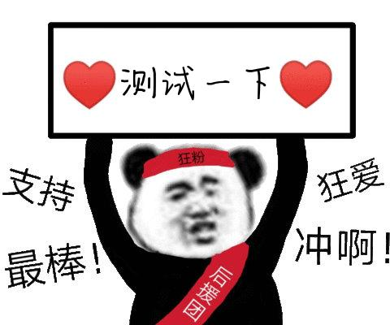 | `fanatic(text)` |
| `luxunsay` / `鲁迅说` | 1 | PNG | `鲁迅说 找CC去` | 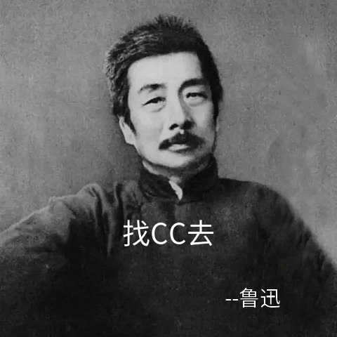 | `luxunsay(text)` |
| `ascension` / `升天` | 1 | JPG | `升天 做了好事` |  | `ascension(text)` |
| `badnews` / `悲报` | 1 | PNG | `悲报 一个悲伤的故事` |  | `badnews(text)` |
| `bronya_holdsign` / `大鸭鸭举牌` | 1 | JPG | `大鸭鸭举牌 许伟是帅哥` |  | `bronya_holdsign(text)` |
| `findchips` / `整点薯条` | 4 | JPG | `整点薯条 我们要飞向何方\|我打算待会去码头整点薯条\|你误会了伙计\|为了待会去码头整点薯条` | 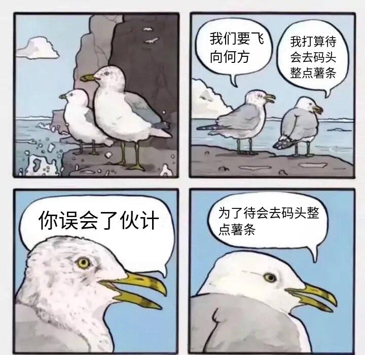 | `findchips([text1, text2, text3, text4])` |
| `goodnews` / `喜报` | 1 | PNG | `喜报 今天周五啦` |  | `goodnews(text)` |
| `high_EQ` / `高情商` / `高情商低情商` | 2 | JPG | `高情商 笨蛋\|聪明蛋` | 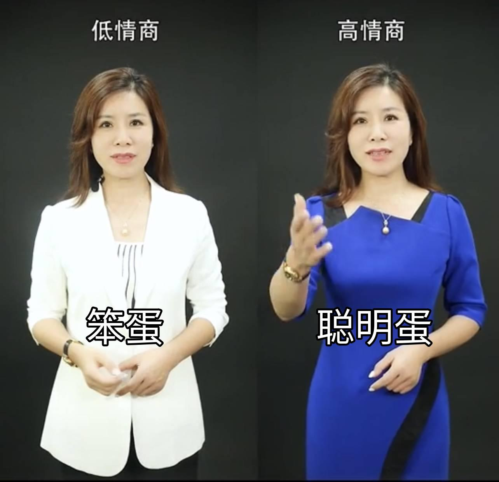 | `high_EQ(left, right)` |
| `holdgrudge` / `记仇` | 1 | JPG | `记仇 天气很柴` | 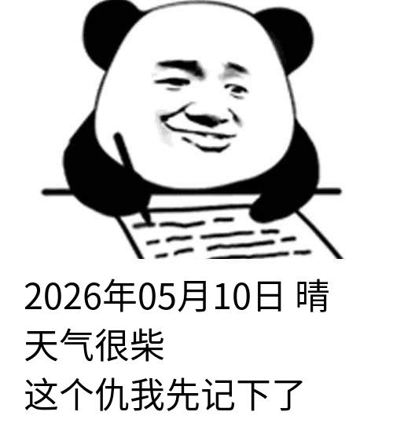 | `holdgrudge(text)` |
| `imprison` / `坐牢` | 1 | JPG | `坐牢 坐牢` | 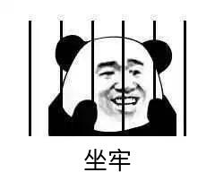 | `imprison(text)` |
| `meteor` / `流星` | 1 | JPG | `流星 流星` | 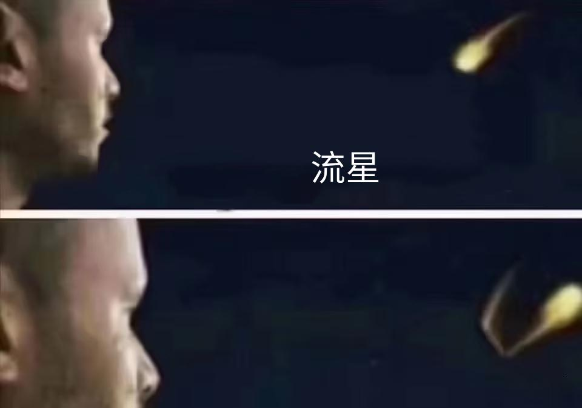 | `meteor(text)` |
| `murmur` / `低语` | 1 | PNG | `低语 许伟是帅哥` | 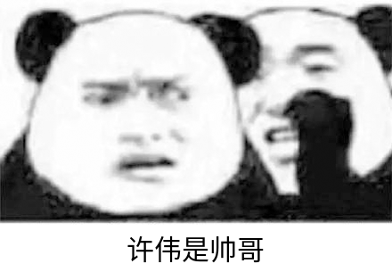 | `murmur(text)` |
| `nokia` / `有内鬼` | 1 | JPG | `有内鬼 飞哥 11点去吃饭` | 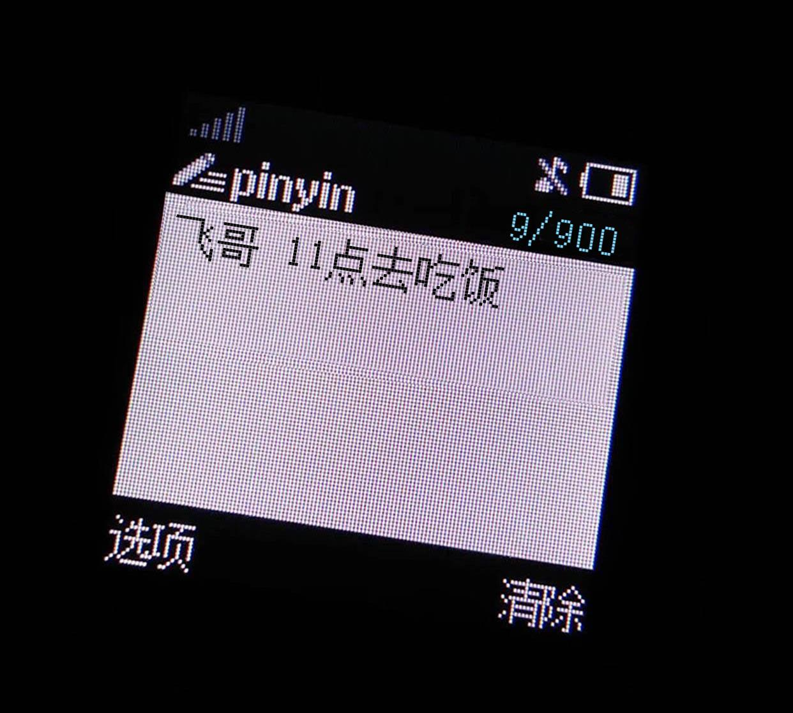 | `nokia(text)` |
| `not_call_me` / `不喊我` | 1 | PNG | `不喊我 不喊我` | 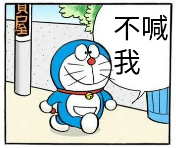 | `not_call_me(text)` |
| `raisesign` / `举牌` | 1 | JPG | `举牌 许伟是帅哥` |  | `raisesign(text)` |
| `run` / `黑人快跑` / `快跑` | 1 | JPG | `黑人快跑 许伟是帅哥` |  | `run(text)` |
| `scratchoff` / `刮刮乐` | 1 | JPG | `刮刮乐 许伟是帅哥` |  | `scratchoff(text)` |
| `scroll` / `滚屏` | 1 | GIF | `滚屏 许伟是帅哥` | 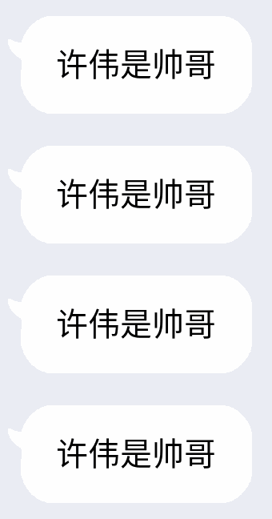 | `scroll(text)` |
| `shutup` / `别说了` | 1 | JPG | `别说了 别说了` | 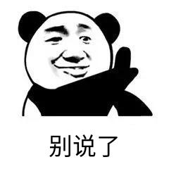 | `shutup(text)` |
| `slap` / `一巴掌` | 1 | JPG | `一巴掌 我的世界` | 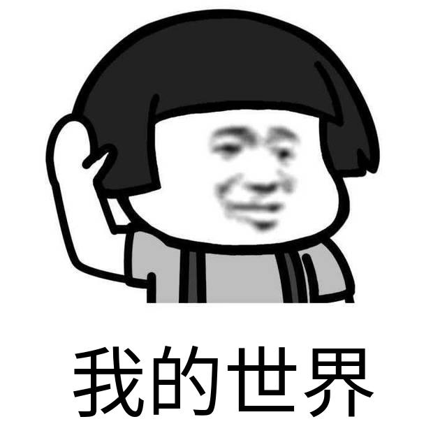 | `slap(text)` |
| `slogan` / `口号` | 6 | JPG | `口号 我们是谁\|打折福利\|我们要做什么\|为顾客送福利\|我们该怎么做\|立即打折` | 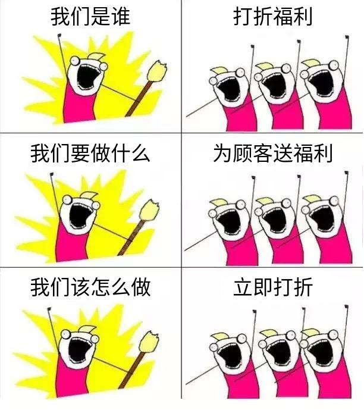 | `slogan([text1, text2, text3, text4, text5, text6])` |
| `wakeup` / `牛起来了` | 1 | JPG | `牛起来了 牛` |  | `wakeup(text)` |
| `wish_fail` / `许愿失败` | 1 | JPG | `许愿失败 许伟是帅哥` | 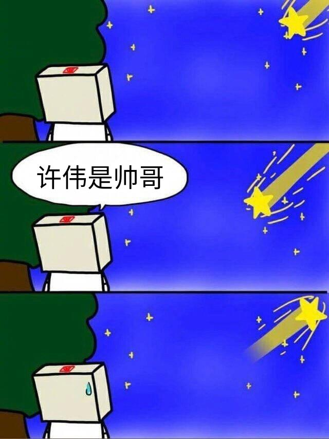 | `wish_fail(text)` |
| `wujing` / `吴京` | 2 | JPG | `吴京 人\|不骗` | 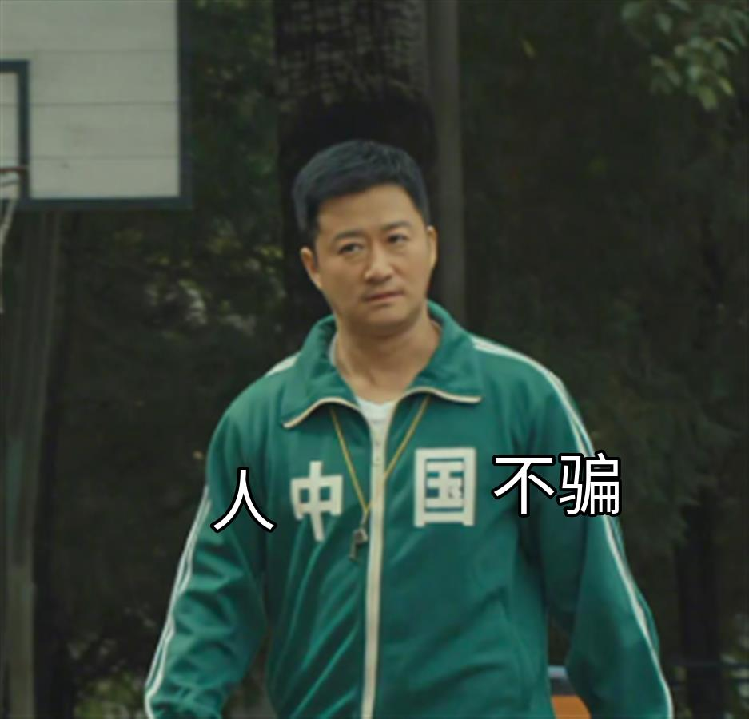 | `wujing(left, right)` |
| `laotou` / `老头` | 1 | JPG | `老头 老实的湖北人不敢讲话` |  | `laotou(text)` |
| `dezui` / `得罪` | 1 | PNG | `得罪 吴` | 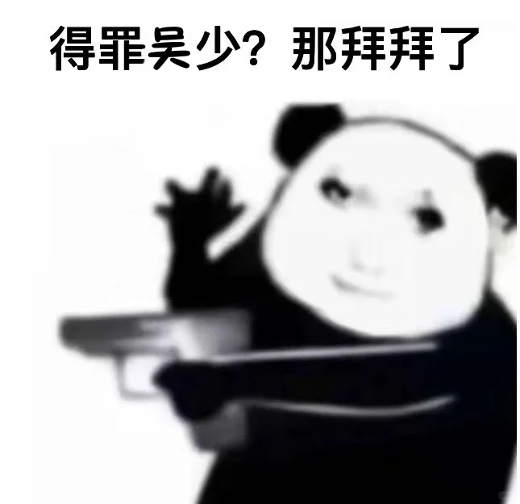 | `dezui(text)` |

## GIF 模板指令

这些模板统一走 `make_gif_by_type(type, texts)`，输出 GIF。

| 指令 | 参数数量 | 示例 | 效果图 | 对应 type |
| --- | ---: | --- | --- | --- |
| `wangjingze` / `王境泽` | 4 | `王境泽 我就是饿死\|死外边 从这里跳下去\|不会吃你们一点东西\|真香` | 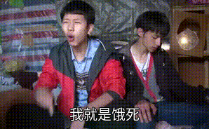 | `wangjingze` |
| `weisuoyuwei` / `为所欲为` | 9 | `为所欲为 好啊\|就算你是一流工程师\|就算你出报告再完美\|我叫你改报告你就要改\|毕竟我是客户\|客户了不起啊\|Sorry 客户真的了不起\|以后叫他天天改报告\|天天改 天天改` |  | `weisuoyuwei` |
| `chanshenzi` / `馋身子` | 3 | `馋身子 你那叫喜欢吗？\|你那是馋她身子\|你下贱！` | 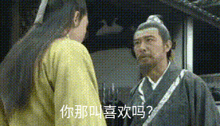 | `chanshenzi` |
| `qiegewala` / `窃格瓦拉` / `窃贼周先生` | 6 | `窃格瓦拉 没有钱啊\|肯定要做的啊\|不做的话没有钱用\|那你不会去打工啊\|有手有脚的\|打工是不可能打工的` |  | `qiegewala` |
| `shuifandui` / `谁反对` | 4 | `谁反对 我话说完了\|谁赞成\|谁反对\|我反对` | 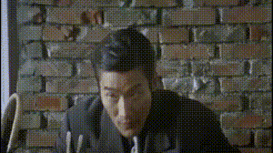 | `shuifandui` |
| `zengxiaoxian` / `曾小贤` | 4 | `曾小贤 平时你打电子游戏吗\|偶尔\|星际还是魔兽\|连连看` | 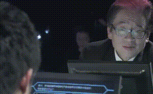 | `zengxiaoxian` |
| `yalidaye` / `压力大爷` | 3 | `压力大爷 外界都说我们压力大\|我觉得吧压力也没有那么大\|主要是28岁了还没媳妇儿` | 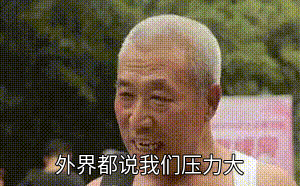 | `yalidaye` |
| `nihaosaoa` / `你好骚啊` | 3 | `你好骚啊 既然追求刺激\|就贯彻到底了\|你好骚啊` |  | `nihaosaoa` |
| `shishilani` / `食屎啦你` | 4 | `食屎啦你 穿西装打领带\|拿大哥大有什么用\|跟着这样的大哥\|食屎啦你` |  | `shishilani` |
| `wunian` / `五年` | 4 | `五年 五年\|你知道我这五年是怎么过的吗\|我每天躲在家里玩贪玩蓝月\|你知道有多好玩吗` |  | `wunian` |

## 参数限制

- 所有模板都有文字长度限制，超出时函数会返回 `文字长度过长，请适当缩减`。
- `nokia` 会把文本截断到前 900 个字符。
- `scroll` 最多适合 5 行以内文本。
- `findchips` 必须传 4 段文本。
- `slogan` 必须传 6 段文本。
- `weisuoyuwei` 必须传 9 段文本。
- 其他 GIF 模板的段数见上表。

## 有资源但当前没有生成函数的模板

以下缩略图或资源存在，但当前代码里没有对应的生成函数入口，暂不建议作为飞书指令开放：

| 资源名 | 说明 |
| --- | --- |
| `5000choyen` | 只有缩略图，未见生成函数 |
| `douyin` | 只有缩略图，未见生成函数 |
| `google` | 只有缩略图，未见生成函数 |
| `pornhub` | 只有缩略图，未见生成函数 |
| `youtube` | 有部分图片资源，但当前未见完整生成函数 |
